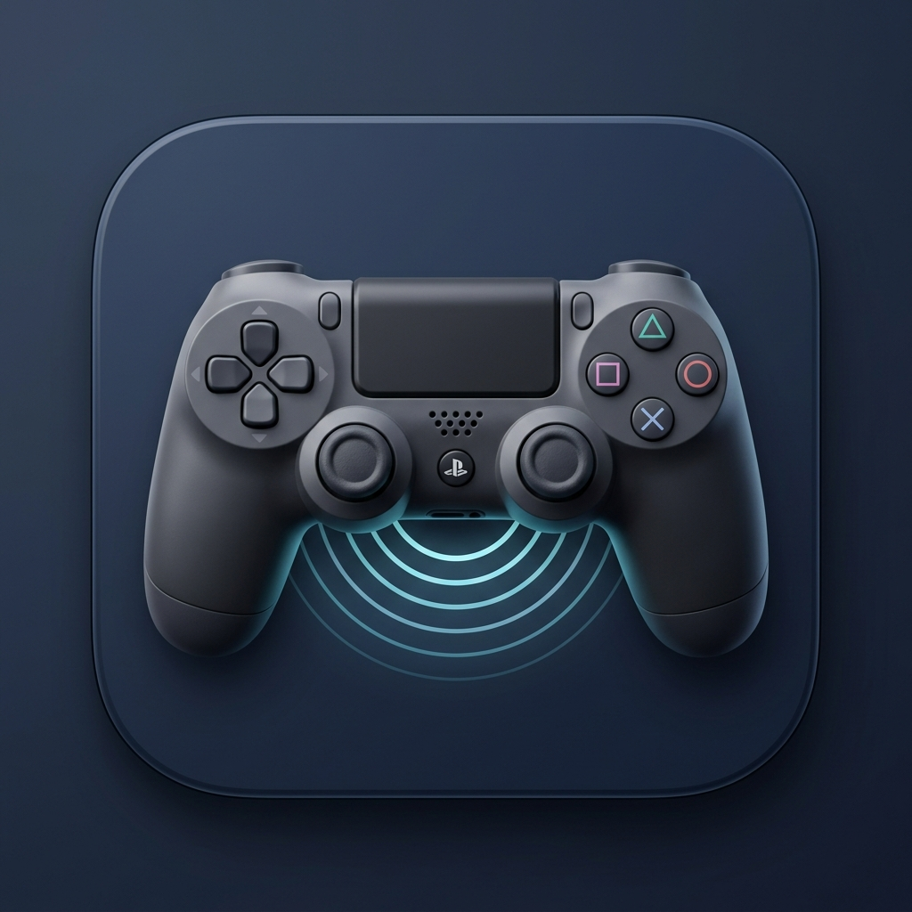
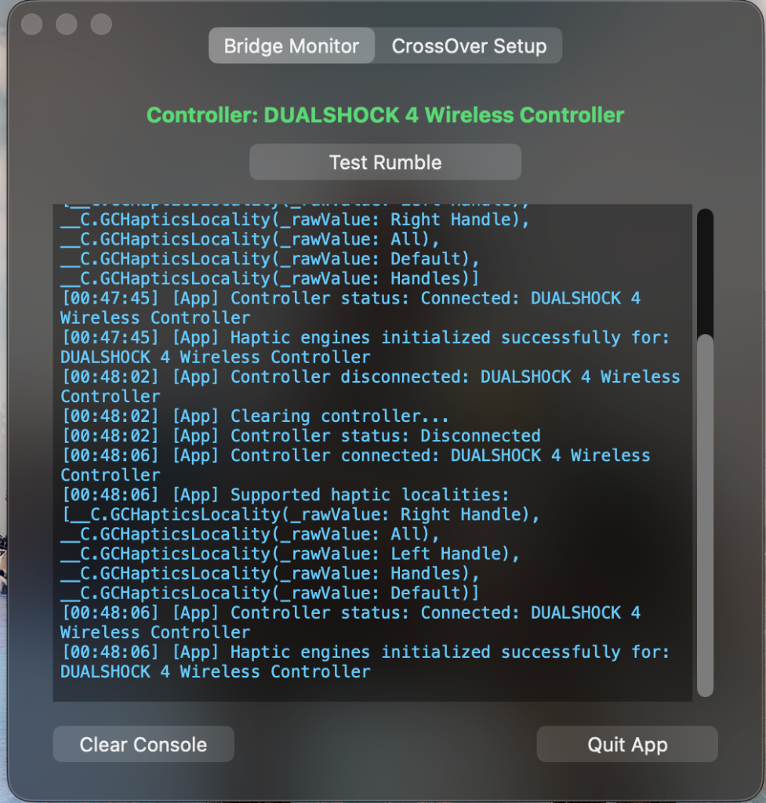
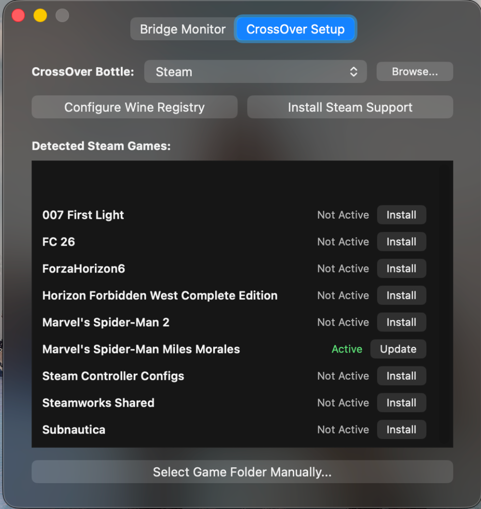
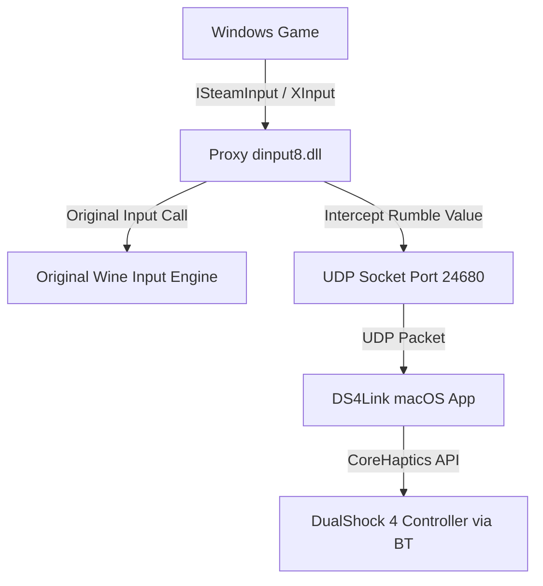

# DS4Link

<p align="center">
  
</p>

**DS4Link** is a premium macOS utility designed to bring **native DualShock 4 (PS4) controller features**—including wireless Bluetooth rumble/force-feedback, motion controls (gyro), and correct DirectInput/Steam Input UI button mapping—into Windows games running inside **CrossOver** and Wine.

Typically, macOS Wine translation layers strip out controller vibration and advanced haptic support over Bluetooth. **DS4Link** solves this by routing rumble packets out of the Wine environment back to the macOS host via a lightweight UDP loop, translating them directly to Apple's native CoreHaptics framework with sub-millisecond latency.

---

## 📸 App Preview

<p align="center">
  &nbsp;&nbsp;&nbsp;&nbsp;
  
</p>

---

## ⚡ Key Features

* **Zero-Latency Bluetooth Rumble**: Converts legacy Steamworks, modern Steam Input, XInput (`XInputSetState`), and DirectInput Force Feedback commands to Apple CoreHaptics.
* **Automated Wine Registry Patching**: One-click configuration to enable raw macOS `IOHID` backend and disable buggy SDL translations inside your bottle's registry.
* **Steam Games Auto-Detection**: Dynamically scans your selected bottle, lists all installed Steam games, and handles proxy DLL deployment automatically.
* **Manual Game Folder Selection**: Drag-and-drop or select manual folders to deploy rumble support to GOG, Epic Games Store, or standalone titles.
* **Background Haptic Keep-Alive**: Prevents macOS from silencing controller vibrations when the game goes fullscreen or focus changes.
* **Modern Glassmorphic UI**: Beautiful dark-mode interface designed to blend seamlessly with macOS System Settings.

---

## 🚀 Setup & Installation Guide

### Step 1: Install the macOS Application
1. Download **`DS4Link.dmg`** from the [Releases](https://github.com/VedantNarayan/ds4link/releases) section.
2. Double-click the DMG and drag **`DS4Link.app`** to your **Applications** folder.
3. Open **DS4Link**. The status indicator in the first tab should change to green once your DualShock 4 controller is connected to your Mac via Bluetooth.

### Step 2: Configure CrossOver Bottle Registry
1. Go to the **CrossOver Setup** tab inside **DS4Link**.
2. Select your gaming bottle (e.g. `Steam`) from the dropdown. 
   * *If your bottles are on an external drive, click **Browse...** to select your custom Bottles directory.*
3. Click **Configure Wine Registry**. This patches the bottle's `system.reg` and `user.reg` (creating backups first) to enable native macOS raw inputs and register the DLL override.

### Step 3: Install Steam Support
1. Click **Install Steam Support** in the CrossOver Setup tab.
2. This installs the 32-bit proxy controller library to hook Steam's broker interfaces.

### Step 4: Deploy Rumble to Your Games
1. Under **Detected Steam Games**, look for your target game.
2. Click **Install** next to the game name (e.g., *Marvel's Spider-Man: Miles Morales*).
3. *For non-Steam games, click **Select Game Folder Manually...** and select the folder containing your game's main executable.*

### Step 5: Configure Steam Settings (Crucial)
To get correct PlayStation UI buttons and gyroscope support in Steam games:
1. Open Steam inside CrossOver.
2. Go to **Settings** -> **Controller**.
3. Toggle **Enable Steam Input for PlayStation controllers** to **ON**.
4. In the game library, right-click your game, select **Properties** -> **Controller**, and ensure **Steam Input** is set to **Enabled**.

---

## 🛠️ How It Works (Technical Architecture)

DS4Link utilizes a dynamic, safe PE proxy architecture:



1. **PE Interception**: A custom proxy `dinput8.dll` is placed in the game directory. Wine loads this library as "native" rather than its internal version.
2. **Vtable Hooking**: The proxy DLL detours interface creation brokers (`SteamInternal_FindOrCreateUserInterface`). It hooks both modern `ISteamInput` and legacy `ISteamController` virtual tables in-place to capture vibration commands.
3. **UDP Tunneling**: Intercepted vibration data is sent out of the Wine bottle over a local UDP socket on port `24680`.
4. **macOS CoreHaptics Player**: The host app `DS4Link` receives the packet, scales the values, and plays continuous haptic patterns using Apple's GameController framework directly to the controller.

---

## 👨‍💻 Build Instructions

To build the binaries locally:
1. Ensure you have Apple `swiftc` compiler and `mingw-w64` cross-compilers installed via Homebrew.
2. Run the deployment script:
   ```bash
   ./build_and_deploy.sh
   ```
3. Run the DMG packaging script:
   ```bash
   ./create_dmg.sh
   ```

---

## 📄 License
This project is open-source and available under the MIT License.
