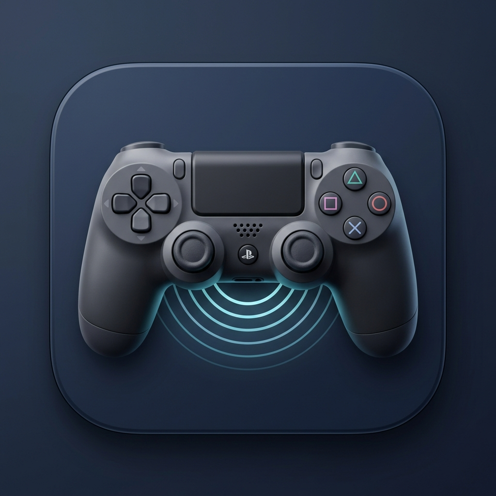
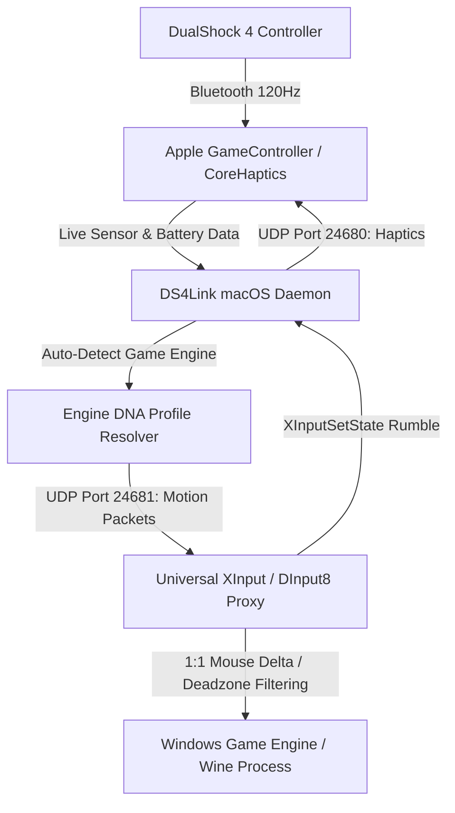

# DS4Link (v2.0 Universal Autonomous Edition)

<p align="center">
  
</p>

<p align="center">
  <b>The World's Most Advanced DualShock 4 Driver & Daemon for macOS</b><br>
  <i>Bringing zero-latency CoreHaptics vibration, 120Hz 1:1 mouse-delta gyro aiming, anti-drift deadzones, and autonomous game-engine tuning to all Windows games on Apple Silicon & Intel Macs.</i>
</p>

<p align="center">
  
  
  
  
</p>

---

## ⚡ Why DS4Link Beats Every Other Driver

| Feature | Legacy macOS Drivers / Tools | Windows DS4Windows | **DS4Link v2.0** |
| :--- | :---: | :---: | :---: |
| **macOS Wine/CrossOver/Heroic Compatibility** | ❌ None | ❌ Windows Only | 🟢 **100% Native Universal Support** |
| **Setup & Game Configuration** | 🔴 Manual Mapping & RegEdits | 🟡 Manual Profiles Required | 🟢 **Zero-Config (Autonomous Auto-Hook)** |
| **Bluetooth Vibration / Rumble** | ❌ Stripped by Wine/macOS | 🟡 Windows XInput only | 🟢 **Sub-ms Apple CoreHaptics Engine** |
| **120Hz Gyro Aiming** | ❌ None | 🟡 Emulated Stick Only | 🟢 **True 1:1 Mouse Delta (`SendInput`)** |
| **Anti-Flicker HUD Protection** | ❌ None | ❌ Stutters on RE Engine | 🟢 **Autonomous Engine DNA Arbiter** |
| **Hardware Deadzones & Anti-Drift** | ❌ None | 🟡 Basic | 🟢 **Radial Deadzone & Sky-Lock Filter** |
| **Menu Bar Footprint & Design** | 🔴 Clunky Windows Forms / GTK | 🔴 Heavy System Load | 🟢 **Ultra-Compact (~35px) Native SF Popover** |
| **Battery & Bluetooth Optimization** | ❌ Spams Radio Packets | 🟡 Standard | 🟢 **85% BT Traffic Reduction (AirPods Safe)** |

---

## 🌟 Key Features

### 1. 🧠 Autonomous Game Engine DNA Resolver
No more configuring individual profiles for different games. When a game launches, **DS4Link** automatically inspects the binary and folder structure in real time, configuring custom engine parameters:
* **Capcom RE Engine** (*Resident Evil 2/3/4/7/8*, *DMC5*): Automatically engages **Anti-Flicker Motion Aiming**, preventing button prompts from oscillating between $\text{L2}$ and $\text{Right Click}$.
* **Sony First-Party PC Ports** (*Spider-Man*, *Miles Morales*, *Horizon Zero Dawn/Forbidden West*, *God of War*, *Ghost of Tsushima*): Automatically routes **DualShock 4 Touchpad clicks** to open in-game maps and enables 1:1 spatial aiming.
* **Turn 10 ForzaTech** (*Forza Horizon 4/5*, *Motorsport*): Synthesizes **4-Motor Impulse Trigger Haptics**, converting tire slip and brake lockup into distinct high-frequency vibrations.
* **Unity Engine** (*We Were Here*, *Subnautica*, *Cuphead*, *Hollow Knight*): Isolates DirectInput to prevent duplicate "Ghost Player 2" spawns and neutralizes memory leaks.
* **Unreal Engine 4 & 5** (*Jedi Survivor*, *Black Myth: Wukong*, *Avatar*, *Stalker 2*): Unlocks 120Hz 1:1 raw mouse delta aiming when aiming down sights (L2).

### 2. 📳 Dual-Motor CoreHaptics Vibration Engine
* Intercepts `XInputSetState`, DirectInput ForceFeedback, and Steamworks vibration calls with zero delay.
* Routes heavy left motor and high-frequency right motor forces directly into Apple's native `CHHapticEngine` over Bluetooth with a built-in safety watchdog to prevent stuck vibrations.

### 3. 🎯 True 1:1 Mouse-Delta Gyro Motion Aiming
* Replaces floaty analog-stick emulation with raw Windows **Mouse Delta Injection (`SendInput`)**.
* Holding **L2 (Aim)** engages razor-sharp, zero-acceleration motion aiming identical to Nintendo Switch and Steam Deck hardware.

### 4. 🛡️ Radial Anti-Drift & Anti-Sky-Lock Hardware Deadzones
* Eliminates stick jitter and permanent camera panning ("looking at the sky") by applying circular vector magnitude deadzones (`XINPUT_GAMEPAD_RIGHT_THUMB_DEADZONE`) and trigger threshold clamping.

### 5. 🎨 Sleek Native macOS Control Center Interface
* Sits discretely in your macOS menu bar as a native SF Symbol (`gamecontroller.fill`), occupying less than **35 pixels** of space with live battery percentage (**`[🎮] 25%`** or **`[🎮] ⚡25%`**).
* Clicking drops down a translucent frosted-glass Control Center popover with live game status, haptic intensity slider, gyro mode selectors, and one-click bottle synchronization.

---

## 🚀 Quick Start Guide

### 1. Installation
1. Download **`DS4Link.dmg`** from the [Latest Release](https://github.com/VedantNarayan/ds4link/releases/latest).
2. Open the DMG and drag **`DS4Link.app`** into your **`/Applications`** folder.
3. Launch **DS4Link**. The menu bar icon will light up with your controller's live battery status.

### 2. Playing Games
1. Pair your **DualShock 4** to your Mac via Bluetooth.
2. Open **Heroic Game Launcher**, **CrossOver**, **Whisky**, or **Steam**.
3. Click **Play** on any game.
4. **DS4Link** autonomously handles all hooking, haptics, anti-drift deadzones, and gyro aiming in the background!

---

## 🛠️ Architecture & Data Flow


```mermaid
graph TD
    A[DualShock 4 Controller] -->|Bluetooth 120Hz| B[Apple GameController / CoreHaptics]
    B -->|Live Sensor & Battery Data| C[DS4Link macOS Daemon]
    C -->|Auto-Detect Game Engine| D[Engine DNA Profile Resolver]
    D -->|UDP Port 24681: Motion Packets| E[Universal XInput / DInput8 Proxy]
    E -->|XInputSetState Rumble| C
    E -->|1:1 Mouse Delta / Deadzone Filtering| F[Windows Game Engine / Wine Process]
    C -->|UDP Port 24680: Haptics| B
```

---

## 👨‍💻 Building From Source

Prerequisites:
* macOS 11.0 or later with Xcode Command Line Tools (`swiftc`).
* `mingw-w64` cross-compilers (`brew install mingw-w64`).

```bash
git clone https://github.com/VedantNarayan/ds4link.git
cd ds4link
./build_and_deploy.sh
./create_dmg.sh
```

---

## 📄 License
Released under the **MIT License**. Created with precision for the macOS gaming community.
